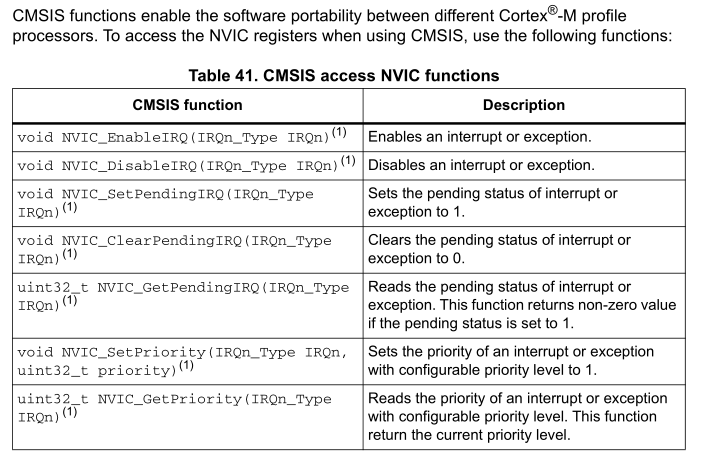
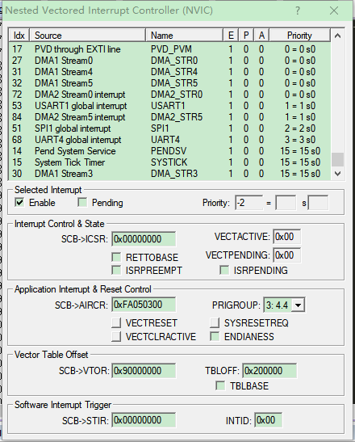
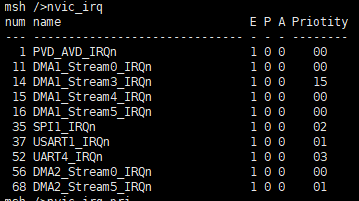
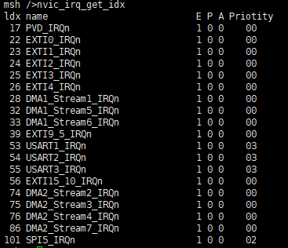
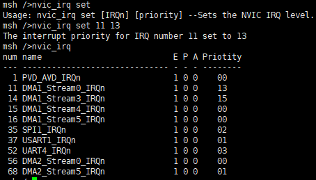

# get_irq_priority

[TOC]

## 1.简介

**get_irq_priority软件包** 主要是提供了获取中断优先级的MSH命令.可以获取系统当前使能的中断与中断名以及中断优先级等信息.仿照KEIL的DEBUG中的NVIC实现.

- 目前仅支持STM32系列

| 芯片系列 | 是否支持 | 是否验证 |
| -------- | -------- | -------- |
| STM32H7  | 支持     | 验证H750 |
| STM32F7  | 支持     | 验证F747 |
| STM32F4  | 支持     | 验证F429 |
| STM32F1  | 支持     | 验证F103 |

### 1.1工作原理简述

**get_irq_priority软件包**中调用了CMSIS提供的查询函数.CMSIS 功能支持不同 Cortex®-M 配置文件处理器之间的软件可移植性.按照原理来说,可以支持Cortex®-M内核的所有芯片查询.



- 软件包输出仿照KEIL5 debug模式中Peripheral->Core Peripheral->NVIC中输出信息实现



### 1.2目录结构

`get_irq_priority` 软件包目录结构如下所示：

``` 
get_irq_priority
├───inc                             // 头文件目录
│   |   ```                 		// 中断名称头文件
|   └───irq_stm32f4.h           	// 中断名称头文件
│   └───irq_stm32h7.h           	// 中断名称头文件
├───src                             // 源码目录
│   |   get_irq.c	                // 主功能模块
├───figures                         // 文档使用图片
│   LICENSE                         // 软件包许可证
│   README.md                       // 软件包使用说明
└───SConscript                      // RT-Thread 默认的构建脚本
```

### 1.3许可证

get_irq_priority package 遵循 LGPLv2.1 许可，详见 `LICENSE` 文件。

### 1.4依赖

- RT_Thread MSH

## 2.使用

### 2.1获取组件

- **方式1：**
  1.下载[get_irq_priority软件包](https://github.com/wdfk-prog/rt-thread-get_irq_priority[)，并将软件包`get_irq_priority`文件夹复制到工程原码目录下
  2.将软件包中get_irq.c加入项目工程中
  3.根据芯片定义对应宏指令

- **方式2：**
  通过 *Env配置工具* 或 *RT-Thread studio* 开启软件包，根据需要配置各项参数；配置路径为 *RT-Thread online packages -> system packages -> get_irq_priority* 

## 3.注意事项

- get_irq_priority依赖于控制台而工作，使用本组件时请确认已注册了控制台设备。
- get_irq_priority目前仅支持 Cortex®-M 内核. Cortex®-M 内核中仅对stm32系列做了支持.
- get_irq_priority提供了3种模式，默认查询模式(以irq编号排序),中断优先级查询模式(以中断优先级从低到高排序),设置模式。

## 4.测试验证

组件安装后，在控制台串口中输入nvic_irq_get后回车,既可查看当前使能的中断信息.

### 4.1 STM32H750测试示例



### 4.2 STM32F429测试示例




### 4.3 STM32F429 中断优先级排序 测试示例



## 5. 联系方式

* 维护：wdfk-prog
* 主页：https://github.com/wdfk-prog/rt-thread-get_irq_priority

